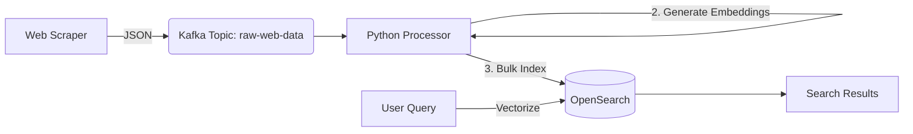

# Project Plan: End-to-End Data Pipeline for Semantic Search

## Summary

**Project Title:** End-to-End Data Pipeline with OpenSearch and Semantic Search
**Objective:** Build a scalable Big Data pipeline that scrapes web data, processes it via message queues, generates vector embeddings, and indexes it into OpenSearch for hybrid (lexical + semantic) search retrieval.
**Scope:** Data acquisition (scraping), ingestion (Kafka), processing (chunking/embedding), storage (OpenSearch), and visualization (OpenSearch Dashboards).
**Team:**
- Andrei-Daniel Anghelescu
- Rares-Alexandru Constantin
- Robert Grancsa
- Ana-Maria Toader

## 2. Technology Stack

| Component | Technology | Role in Pipeline |
| :-- | :-- | :-- |
| **Orchestration** | Docker Compose | Container management for all services |
| **Ingestion** | Apache Kafka | Message queue for buffering scraped raw text |
| **Database** | OpenSearch | Vector database \& search engine (hybrid search) |
| **Processing** | Python 3.12+ | Custom scrapers and middleware consumers |
| **Embeddings** | HuggingFace / ONNX | Sentence-transformers (e.g., `all-MiniLM-L6-v2`) |
| **Visualization** | OpenSearch Dashboards | UI for querying and visualizing data |

## 3. Architecture Overview

The pipeline follows a standard ETL (Extract, Transform, Load) pattern enhanced for vector search:

1. **Data Acquisition (Source):** Python scrapers fetch HTML, clean it, and extract raw text.
2. **Buffering (Queue):** Raw documents are pushed to a Kafka topic (`raw-web-data`).
3. **Transformation (Processor):**
    * Consumer reads from Kafka.
    * **Chunking:** Splits long text into manageable overlapping segments (e.g., 500 tokens).
    * **Embedding:** Generates vector representations (384 dimensions) for each chunk.
4. **Storage (Sink):** Chunks + Vectors are indexed into OpenSearch.
5. **Retrieval:** User queries are embedded and matched using k-NN (k-Nearest Neighbors).

## 5. Development Roadmap (7 Weeks)

### Phase 1: Infrastructure (Weeks 1-2)

- [ ] Set up Docker Compose for OpenSearch, Dashboards, and Kafka.[^11]
- [ ] Verify connectivity between containers.
- [ ] Create initial index mappings with k-NN enabled.

### Phase 2: Data Pipeline (Weeks 3-4)

- [ ] Develop Python scraper for target websites.[^12][^13]
- [ ] Implement Kafka Producer to stream raw data.
- [ ] Implement Kafka Consumer to read and print data (test).

### Phase 3: Semantic Processing (Weeks 5-6)

- [ ] Integrate `sentence-transformers` for local embedding generation.[^14][^15]
- [ ] Implement chunking logic (sliding window).
- [ ] Connect Consumer output to OpenSearch bulk indexing API.

### Phase 4: UI \& Refinement (Week 7)

- [ ] Build a simple Streamlit or Flask frontend for user queries.
- [ ] Visualize document ingest rates in OpenSearch Dashboards.
- [ ] Tune k-NN parameters (ef_search, m) for performance.

## 6. Alternative: OpenSearch Native Pipelines

Instead of external Python processing, OpenSearch 2.9+ supports **Neural Search** plugins (runing models inside OpenSearch).

* **Pros:** Simplified architecture (no separate Python processor service).
* **Cons:** Higher hardware resource requirement for the OpenSearch node.
* **Recommendation:** Stick to the Python external processor approach for this project to demonstrate modular Big Data engineering skills (Queue + Worker pattern) as requested in the description.

## 7. References

1. OpenSearch Project. "Neural Search \& k-NN." *OpenSearch Documentation*, 2024.
2. Reimers, Nils. "Sentence-BERT: Sentence Embeddings using Siamese BERT-Networks." *sbert.net*, 2019.
3. Kafka Documentation. "Producers and Consumers." *Apache Kafka*, 2024.
[^1][^10][^2][^3][^4][^5][^6][^7][^8][^9]

⁂

[^1]: https://www.markdownguide.org/basic-syntax/

[^2]: https://markdown-it.github.io

[^3]: https://www.markdownguide.org/getting-started/

[^4]: https://docs.github.com/github/writing-on-github/getting-started-with-writing-and-formatting-on-github/basic-writing-and-formatting-syntax

[^5]: https://quarto.org/docs/authoring/markdown-basics.html

[^6]: https://www.sitepoint.com/learn-markdown/

[^7]: https://learn.microsoft.com/en-us/azure/devops/project/wiki/markdown-guidance?view=azure-devops

[^8]: https://stackoverflow.com/questions/19699059/print-directory-file-structure-with-icons-for-representation-in-markdown

[^9]: https://docs.gitlab.com/user/markdown/

[^10]: https://the.fibery.io/@public/User_Guide/Guide/Markdown-Templates-53

[^11]: https://aws.amazon.com/blogs/big-data/amazon-opensearch-service-vector-database-capabilities-revisited/

[^12]: https://www.nimbleway.com/blog/the-definitive-guide-to-web-scraping-in-2024

[^13]: https://dev.to/dowerdev/effective-web-scraping-with-python-building-a-robust-data-pipeline-for-price-monitoring-5g6d

[^14]: https://dzone.com/articles/building-a-rag-model-pipeline-using-python

[^15]: https://docs.opensearch.org/latest/tutorials/vector-search/vector-operations/generate-embeddings/

